<div align="center">

#  GoCart.

### A Modern Multi-Vendor E-Commerce Platform

Built with **Next.js 16**, **TypeScript**, **Redux Toolkit**, **Prisma**, **Clerk**, **Stripe** & **Tailwind CSS**

[](https://nextjs.org/)
[](https://www.typescriptlang.org/)
[](https://www.prisma.io/)
[](https://tailwindcss.com/)
[](./LICENSE)

</div>

---

## 📸 Screenshots

|               Home               |            Shop             |
| :------------------------------: | :-------------------------: |
| 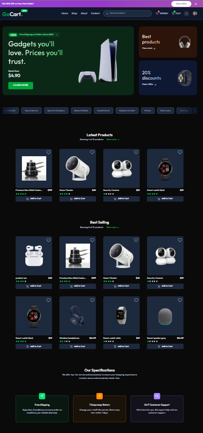 | 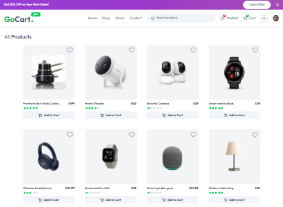 |

|            Product Details             |            Cart             |
| :------------------------------------: | :-------------------------: |
| 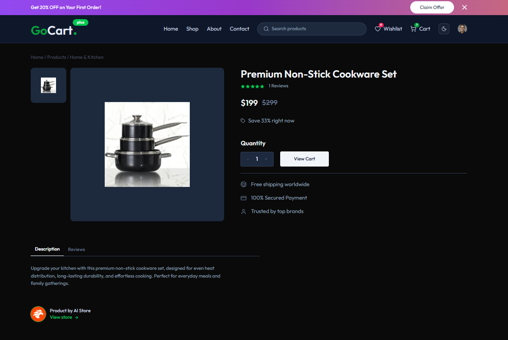 | 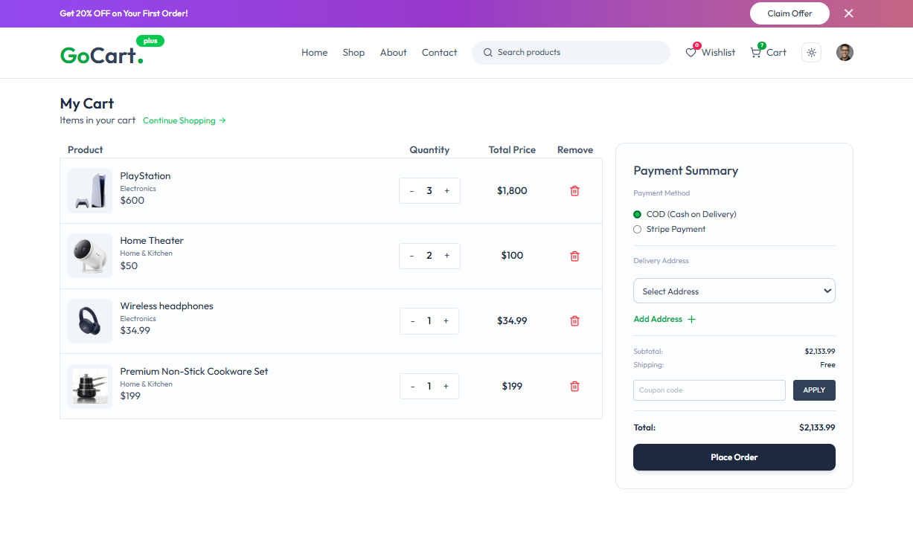 |

|            Wishlist             |            Order Details             |
| :-----------------------------: | :----------------------------------: |
| 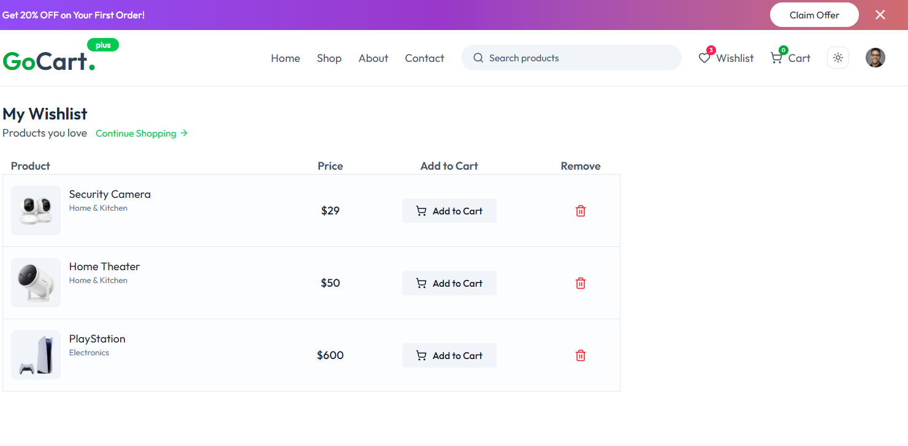 |  |

|            Seller Dashboard             |            Product Manager             |
| :-------------------------------------: | :------------------------------------: |
| 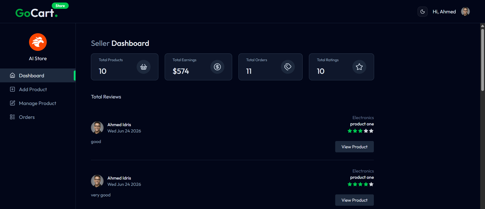 | 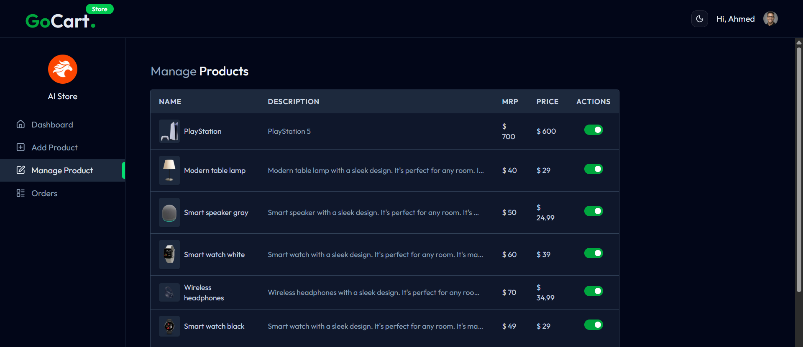 |

|            Add Product             |            Admin Dashboard             |
| :--------------------------------: | :------------------------------------: |
| 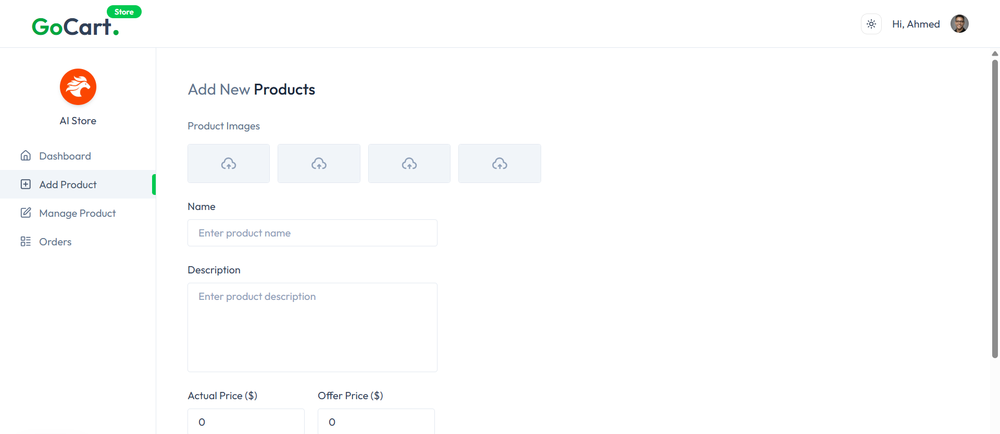 | 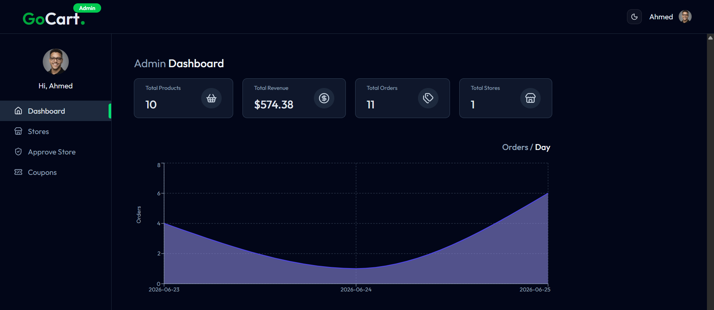 |

|            Stores Management             |            Add Coupons             |
| :--------------------------------------: | :--------------------------------: |
| 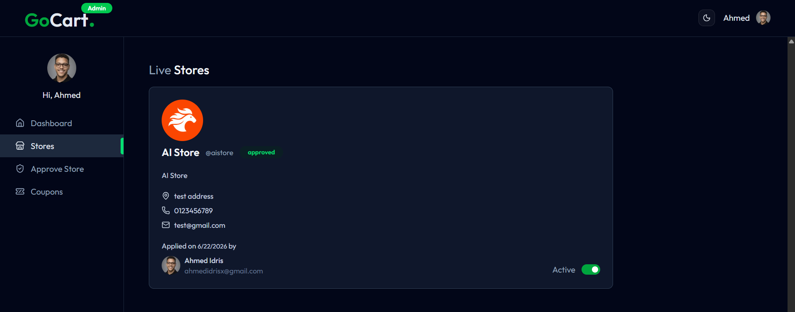 | 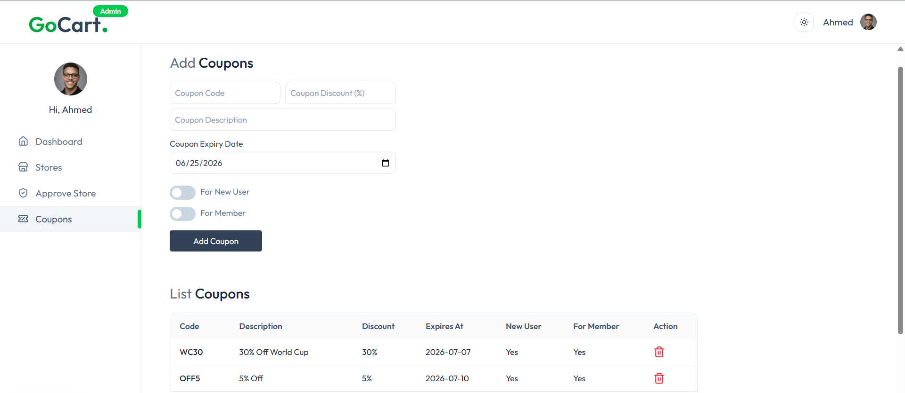 |

|            Add Address             |
| :--------------------------------: |
| 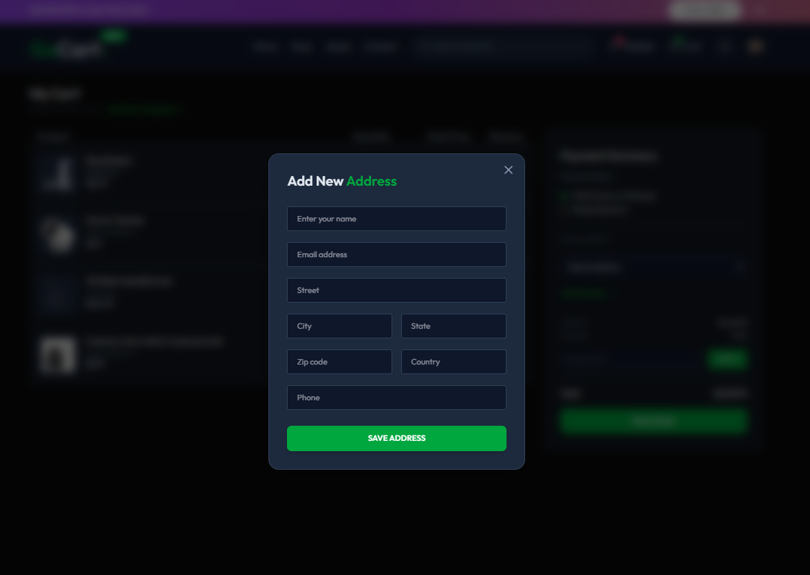 |

---

## ✨ Features

### 🛍️ Customer Experience

- **Product Browsing** — Browse in-stock products from active stores, with search and category filtering (`/shop`)
- **Product Details** — Image gallery with thumbnail selector, star ratings, reviews, MRP vs. sale price with discount percentage
- **Shopping Cart** — Real-time quantity controls via `Counter` component, cart state synced to backend with debounced `uploadCart` thunk (1 s delay)
- **Wishlist** — Toggle ❤️ on any product card; `/wishlist` page with one-click "Move to Cart" that removes from wishlist automatically
- **Checkout** — Multi-address management with `AddressModal`, coupon code verification (new-user / member-only / public), COD or Stripe payment
- **Order Tracking** — View order history with status badges (`ORDER_PLACED → PROCESSING → SHIPPED → DELIVERED`)
- **Ratings & Reviews** — Submit per-product ratings tied to a specific `orderId` (prevents duplicate reviews)
- **Dark Mode** — System-aware theme toggling via `next-themes`
- **Membership Tiers** — Clerk "Plus" plan: free shipping + access to member-only coupons

### 🏪 Seller Dashboard (`/store`)

- **Store Application** — Submit store profile with logo upload (ImageKit) → status: `pending → approved / rejected`
- **Product Management** — Add products with multi-image upload (auto-optimized to WebP via ImageKit), toggle in-stock/out-of-stock
- **Order Management** — View incoming orders, update status (`ORDER_PLACED → PROCESSING → SHIPPED → DELIVERED`)
- **Dashboard Analytics** — Total earnings, total orders, total products, customer reviews

### 🔧 Admin Dashboard (`/admin`)

- **Platform Metrics** — Total orders, stores, products, revenue with revenue chart (Recharts)
- **Store Approval** — Approve or reject pending seller applications; toggle store `isActive` status
- **Coupon Management** — Create coupons (public, new-user-only, member-only) with expiry; auto-delete on expiry via Inngest background job
- **Store Listing** — View all approved stores with user info

### 🔐 Authentication & Authorization

- **Clerk** — Sign-up, sign-in, SSO, user profiles, session management
- **User Sync** — Inngest functions auto-sync Clerk `user.created`, `user.updated`, `user.deleted` events to the Prisma `User` table
- **Role-Based Access** — `authAdmin` middleware (email-based), `authSeller` middleware (checks approved store ownership)
- **Clerk Plans** — "Plus" plan badge in Navbar, free shipping, member-only coupons

---

## 🛠️ Tech Stack

| Layer                | Technology                      | Role in GoCart                                                    |
| -------------------- | ------------------------------- | ----------------------------------------------------------------- |
| **Framework**        | Next.js 16 (App Router)         | Pages, API routes, SSR/RSC                                        |
| **Language**         | TypeScript 5                    | End-to-end type safety                                            |
| **Styling**          | Tailwind CSS 4                  | Utility-first styling + dark mode                                 |
| **UI Components**    | shadcn/ui + Radix UI            | Primitives (dialogs, dropdowns)                                   |
| **State Management** | Redux Toolkit + React Redux     | 5 slices: cart, wishlist, product, address, rating                |
| **Database**         | PostgreSQL on Neon (serverless) | Persistent data via `@prisma/adapter-neon` + WebSocket            |
| **ORM**              | Prisma 6                        | Schema, migrations, type-safe queries                             |
| **Authentication**   | Clerk                           | Sign-up/in, SSO, session, plans                                   |
| **Payments**         | Stripe                          | Checkout sessions + webhook (`payment_intent.succeeded/canceled`) |
| **Image Uploads**    | ImageKit                        | Upload, auto-optimize (WebP, quality=auto), CDN delivery          |
| **Background Jobs**  | Inngest                         | User sync (Clerk webhooks), coupon auto-deletion                  |
| **Charts**           | Recharts                        | Admin dashboard revenue chart                                     |
| **Icons**            | Lucide React                    | All UI icons                                                      |
| **Notifications**    | React Hot Toast                 | Success/error/loading toasts                                      |
| **Date Utils**       | date-fns                        | Order date formatting                                             |

---

## 📁 Project Structure

```
go-cart/
├── app/
│   ├── (public)/               # Customer-facing routes (Navbar + Footer layout)
│   │   ├── cart/page.tsx        # Shopping cart (client component, Redux)
│   │   ├── wishlist/page.tsx    # Wishlist (client component, Redux)
│   │   ├── orders/             # Order history
│   │   ├── product/[id]/       # Product details (dynamic route)
│   │   ├── shop/               # Product listing + search
│   │   ├── pricing/            # Membership pricing page
│   │   ├── create-store/       # Seller application form
│   │   ├── sign-in/ & sign-up/ # Clerk auth pages
│   │   └── layout.tsx          # Banner + Navbar + AppInitializer + Footer
│   ├── admin/                  # Admin dashboard (admin layout with sidebar)
│   │   ├── page.tsx            # Dashboard metrics + revenue chart
│   │   ├── approve/            # Store approval page
│   │   ├── coupons/            # Coupon management
│   │   └── stores/             # Approved store listing
│   ├── store/                  # Seller dashboard (seller layout with sidebar)
│   │   ├── page.tsx            # Seller metrics + reviews
│   │   ├── add-product/        # Add product form
│   │   ├── manage-product/     # Product list + stock toggle
│   │   └── orders/             # Seller order management
│   ├── api/                    # 11 API route groups (see API.md)
│   ├── layout.tsx              # Root: ClerkProvider → ThemeProvider → StoreProvider
│   └── StoreProvider.tsx       # Redux Provider wrapper
├── components/                 # 25+ reusable components
│   ├── AppInitializer.tsx      # Dispatches fetchCart/fetchWishlist/fetchProducts/etc on mount
│   ├── ProductCard.tsx         # Product card with WishlistButton
│   ├── WishlistButton.tsx      # ❤️ toggle (Redux-driven)
│   ├── Counter.tsx             # Cart quantity +/- buttons
│   ├── OrderSummary.tsx        # Cart summary + coupon + checkout
│   ├── AddressModal.tsx        # Add address dialog
│   ├── Navbar.tsx              # Nav with cart/wishlist badges from Redux
│   └── ui/                     # shadcn/ui primitives
├── lib/
│   ├── features/               # Redux slices (5 total)
│   │   ├── cart/cartSlice.ts
│   │   ├── wishlist/wishlistSlice.ts
│   │   ├── product/productSlice.ts
│   │   ├── address/addressSlice.ts
│   │   └── rating/ratingSlice.ts
│   ├── prisma.ts               # Prisma client singleton (Neon adapter)
│   └── utils.ts                # Shared utility functions
├── store/store.ts              # Redux store (makeStore + getStore singleton)
├── hooks/hooks.ts              # useAppDispatch, useAppSelector, useAppStore
├── types/types.ts              # All TypeScript interfaces (228 lines)
├── middlewares/                # Server-side auth helpers
│   ├── authAdmin.ts            # Checks ADMIN_EMAIL env list
│   └── authSeller.ts           # Checks approved store ownership
├── inngest/                    # Background job definitions
│   ├── client.ts               # Inngest client instance
│   └── functions.ts            # syncUserCreation/Update/Deletion + deleteCouponOnExpiry
├── configs/imageKit.ts         # ImageKit SDK configuration
├── prisma/schema.prisma        # Database schema (9 models)
└── package.json                # Dependencies & scripts
```

---

## 🚀 Getting Started

### Prerequisites

- **Node.js** 18.17 or later
- **npm** (or yarn / pnpm)
- **PostgreSQL** database (recommended: [Neon](https://neon.tech/) serverless)
- **Clerk** account — [clerk.com](https://clerk.com)
- **Stripe** account — [stripe.com](https://stripe.com)
- **ImageKit** account — [imagekit.io](https://imagekit.io)
- **Inngest** account — [inngest.com](https://inngest.com)

### 1. Clone the Repository

```bash
git clone https://github.com/Ahmed-Idrisx/go-cart-multi-vendors-e-commerce-app.git
cd go-cart-multi-vendors-e-commerce-app
```

### 2. Install Dependencies

```bash
npm install
```

> The `postinstall` script automatically runs `prisma generate`.

### 3. Set Up Environment Variables

```bash
cp .env.example .env
```

Fill in all values — see [`.env.example`](./.env.example) for descriptions. Required services:

| Variable                                                               | Source                            |
| ---------------------------------------------------------------------- | --------------------------------- |
| `NEXT_PUBLIC_CLERK_PUBLISHABLE_KEY`, `CLERK_SECRET_KEY`                | Clerk Dashboard → API Keys        |
| `DATABASE_URL`, `DIRECT_URL`                                           | Neon Console → Connection Details |
| `STRIPE_SECRET_KEY`, `STRIPE_WEBHOOK_SECRET`                           | Stripe Dashboard → Developers     |
| `IMAGEKIT_PUBLIC_KEY`, `IMAGEKIT_PRIVATE_KEY`, `IMAGEKIT_URL_ENDPOINT` | ImageKit Dashboard                |
| `INNGEST_EVENT_KEY`, `INNGEST_SIGNING_KEY`                             | Inngest Dashboard → Manage        |
| `ADMIN_EMAIL`                                                          | Comma-separated admin emails      |

### 4. Set Up the Database

```bash
npx prisma db push
```

### 5. Run the Development Server

```bash
npm run dev
```

Open [http://localhost:3000](http://localhost:3000).

---

## 🏗️ Build for Production

```bash
npm run build    # Runs: prisma generate && next build
npm start        # Starts the production server
```

---

## 🌐 Deployment

Optimized for **[Vercel](https://vercel.com/)**:

1. Push your repository to GitHub
2. Import on [Vercel](https://vercel.com/new)
3. Add all environment variables from `.env.example`
4. Set up Stripe webhook endpoint: `https://your-domain.com/api/stripe`
5. Configure Clerk webhook (Inngest) for user sync events
6. Deploy

---

## 🔮 Future Improvements

- [ ] Real-time order status notifications (WebSocket / SSE)
- [ ] Advanced product filtering (price range, multi-category, sort)
- [ ] Full-text product search (Algolia / Meilisearch)
- [ ] Email notifications (order confirmation, shipping updates)
- [ ] Multi-language support (i18n)
- [ ] Product image deletion from ImageKit on product removal
- [ ] Seller product editing (currently add-only)
- [ ] Pagination for product listings and orders
- [ ] Unit & integration testing (Jest, Playwright)
- [ ] Rate limiting on API routes

---

## 📚 Documentation

| Document                               | Description                                      |
| -------------------------------------- | ------------------------------------------------ |
| [ARCHITECTURE.md](./ARCHITECTURE.md)   | System architecture, folder structure, data flow |
| [SYSTEM_DESIGN.md](./SYSTEM_DESIGN.md) | High-level design, auth/order/payment flows      |
| [API.md](./API.md)                     | Full API reference for all 28 endpoints          |
| [DATABASE.md](./DATABASE.md)           | Prisma schema, models, relationships             |
| [SDLC.md](./SDLC.md)                   | Software development lifecycle documentation     |
| [ROADMAP.md](./ROADMAP.md)             | Future features and improvements                 |
| [CHANGELOG.md](./CHANGELOG.md)         | Version history                                  |
| [CONTRIBUTING.md](./CONTRIBUTING.md)   | Contribution guidelines                          |

---

## 📄 License

This project is licensed under the **MIT License** — see the [LICENSE](./LICENSE) file for details.

---

<div align="center">

**Built with ❤️ by [Ahmed Idris](https://github.com/Ahmed-Idrisx)**

</div>
